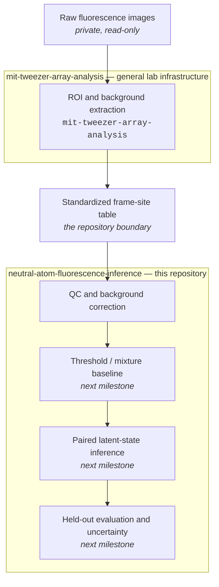

# Neutral-Atom Fluorescence Inference

Statistical inference of latent atom occupancy from paired fluorescence
readout, on a standardized single-condition dataset with frame-dependent
background.

<p align="center">
  
</p>

<!-- BEGIN:dataset-line -->
**Current dataset** — 100 shots · 2 consecutive frames per shot · 100 ms exposure · 200 sites (40,000 site-frame observations, 20,000 site-shot pairs, 2 sites carrying a geometry flag). The independent experimental units are the 100 shots.
<!-- END:dataset-line -->

**Scientific question** — how can latent atom occupancy, and the disagreement
between two consecutive readouts of it, be inferred from noisy fluorescence
measurements whose background depends on which frame you are looking at?

**Current scope** — one imaging condition. Audit, standardized data layer,
paired-readout quality control, and descriptive baselines. No readout fidelity,
false-positive rate, false-negative rate or imaging-loss rate is estimated
here, and [Limitations](#limitations) says exactly why this dataset cannot
support those claims yet.

[**Method**](#method) · [**Results**](#results) ·
[**Reproduce**](#reproduce) · [**Limitations**](#limitations) ·
[**Data audit**](docs/DATA_AUDIT.md) · [**Data contract**](docs/DATA_CONTRACT.md)

---

## Method



Image loading, ROI sums, local-background estimation and grid geometry come
from the general lab analysis package and are reused rather than reimplemented;
`tests/test_reuse_matches_lab.py` pins this repository's helpers to that
implementation numerically. This repository contains no laboratory control
code, no hardware driver, no absolute data path and no raw image. It starts at
the standardized table.

### Locating the sites

The frozen grid corners from an earlier day do not apply to this run, and the
100-shot **mean** image is dominated by a static fringe pattern that a
high-pass trap search cannot see through. The shot-to-shot **variance** map is
the opposite: static structure contributes almost nothing, and every loaded
site becomes a compact variance excess. Both 10 × 10 sub-arrays come out
cleanly, with a sub-pixel lattice residual.

|  |
|:--|
| Two consecutive frames of one shot, identical crop and identical intensity scale, with the fitted ROIs. |

### Extracting counts

Three measurement variants are carried through the table so that downstream
work compares them instead of inheriting one choice: the raw ROI sum, the sum
minus a local annulus background, and the sum minus a common mode measured on
genuinely site-free pixels of the same frame. A median over the sites is never
used as a background — a change in occupied fraction would then be absorbed
into "background".

|  |
|:--|
| Pooled background-corrected counts per frame. The fit is descriptive and for display: it is fitted on all data, has no held-out split and no per-site structure. It is not a fidelity estimate. |

### Pairing the two readouts

|  |  |
|:--|:--|
| Every site-shot pair, with the four apparent regions. Site-level pairs are not independent experimental units. | Signal, background and spread across the array, with the geometry-flagged sites outlined. |

---

## Results

Everything below is generated by the pipeline into
[`reports/readme_metrics.md`](reports/readme_metrics.md) and injected here. No
metric in this README is typed by hand.

<!-- BEGIN:results -->
### Dataset, as measured

| quantity | value |
|---|---|
| Shots | 100 |
| Frames per shot | 2 |
| Exposure per frame | 100 ms |
| Inter-frame start separation | 110 ms (100 ms exposure + 10 ms gap) |
| Sites | 200 (two 10x10 sub-arrays) |
| ROI | 25 px per site |
| Site-frame observations | 40,000 |
| Site-shot pairs | 20,000 |
| Rows carrying a quality flag | 400 |
| Sites with a geometry flag | 2 of 200 |
| Lattice fit residual (median / P95) | 0.47 / 0.82 px |
| Saturated ROI pixels | 0 |
| Brightest pixel seen | 2,037 of 65,535 ADU |

### Frame-dependent background

| quantity | value |
|---|---|
| Frame 1 minus frame 0, site-free reference | -9.34 ± 1.40 counts/px |
| Frame 1 minus frame 0, local annulus | -36.56 ± 9.94 counts/px |
| Local annulus level, frame 0 | 591.6 counts/px |
| Site-free level, frame 0 | 521.7 counts/px |

The annulus shift is about four times the site-free shift. The annulus is not
an atom-free region at a 10–11 px site pitch, so part of what it calls
"background" is array light that itself changes between the frames.

### Paired-readout agreement

| quantity | value |
|---|---|
| Paired-readout agreement | 91.77% (95% shot-cluster bootstrap 91.40–92.14%) |
| Apparent bright-to-dark | 11.52% |
| Apparent dark-to-bright | 3.75% |
| Above reference, frame 0 | 57.62% |
| Above reference, frame 1 | 52.57% |

Agreement is computed against per-frame descriptive reference levels.
"Apparent" is meant literally: this run has no matched-empty, dark-frame or
natural-loss control, so a disagreement cannot be assigned to atom loss rather
than to misclassification.

### Measurement variants

| variant | definition | frame | d' | model-implied overlap | drift / 100 shots |
|---|---|---|---|---|---|
| A | raw ROI sum | 0 | 2.80 | 8.3% | +190 |
| A | raw ROI sum | 1 | 3.29 | 5.1% | +64 |
| B | ROI sum - local background | 0 | 2.76 | 8.9% | +70 |
| B | ROI sum - local background | 1 | 3.17 | 5.8% | +31 |
| C | ROI sum - site-free common mode | 0 | 2.81 | 8.2% | +120 |
| C | ROI sum - site-free common mode | 1 | 3.29 | 5.0% | +5 |

`d'` and the overlap describe the descriptive two-component fit. They are
**not** a readout fidelity, a false-positive rate or a false-negative rate.

### Representative example used in the README assets

- **Shot:** shot whose mean frame-0 raw ROI count is closest to the run median, excluding shot 0 (documented background outlier) → shot order 50.
- **Site:** unflagged site whose mean frame-0 background-corrected count is closest to the median across sites → site 175
  (grid_B, row 7, column 5).
<!-- END:results -->

---

## Reproduce

```bash
git clone https://github.com/niu1298/neutral-atom-fluorescence-imaging-inference.git
cd neutral-atom-fluorescence-imaging-inference
python -m venv .venv && .venv/Scripts/python -m pip install -e ".[dev]"
cp configs/local.example.toml configs/local.toml   # then edit for your machine
```

Then, in order:

```bash
python scripts/audit_source_data.py       --config configs/paired_100ms.yaml
python scripts/export_processed_dataset.py --config configs/paired_100ms.yaml
python scripts/generate_readme_assets.py   --config configs/paired_100ms.yaml
python -m pytest
```

The first command writes the data audit, the second builds and validates
`data/processed/paired_100ms.parquet` and the QC report, and the third
regenerates **every** asset on this page plus the metrics above. Each script
fails with an actionable message when the raw shots are unavailable; none of
them substitutes synthetic data for a missing measurement.

`notebooks/01_data_qc.ipynb` is a presentation layer over the same package. No
asset and no number in this repository depends on running it.

Raw shots live under `Experiment-Data/<date>/<sequence>/` and are gitignored,
as are the processed table and the QC report. Provenance — git commit, config
hash, input-manifest hash — is recorded in every generated artefact; machine
paths never are.

---

## Limitations

**What this dataset can answer.** Whether the bright and dark populations
separate at 100 ms; whether there is a systematic background or signal shift
between the two frames; how consistent the two frames' apparent calls are; how
signal, background and spread vary across sites; the apparent bright-to-dark
and dark-to-bright rates; and which background treatment is more stable against
acquisition order.

**What it cannot.** With one imaging condition, two frames, and no control
data, this run has no identifying information for:

- a true false-positive or false-negative rate, or a readout fidelity —
  mixture overlap is a property of the fitted description, not a measured error
  rate;
- an imaging-induced loss rate — frame-to-frame disagreement mixes real loss
  with misclassification in both frames, and the apparent dark-to-bright rate
  is large enough to prove the misclassification term is not negligible;
- **when** an atom was lost, if it was: during frame 0, during the 10 ms gap,
  or during frame 1;
- an optimal exposure time — the array is nowhere near detector saturation, but
  that is not an exposure-time optimisation;
- generalisation to another day;
- a multi-frame transition hazard.

**Known data issues**, all recorded in [`docs/DATA_AUDIT.md`](docs/DATA_AUDIT.md)
and none of them silently repaired: frame 1 sits systematically below frame 0;
the common-mode level is not stationary within the 231 s run; shot 0 is a
first-shot background outlier and is kept, not dropped; and two of 200 sites
carry a geometry-confidence flag. Sites are localised from atom fluorescence,
so a trap never loaded during these 100 shots could not be localised at all.

---

## Status

| Milestone | State |
|---|---|
| Data audit | done — [`docs/DATA_AUDIT.md`](docs/DATA_AUDIT.md) |
| Standardized data layer | done — [`docs/DATA_CONTRACT.md`](docs/DATA_CONTRACT.md) |
| Image-level QC and background variants | done |
| Threshold and mixture baselines, 60/20/20 held-out split | not started |
| Two-frame latent-state model | not started |
| Identification controls: matched-empty, dark frames, natural-loss | data not yet acquired |
| Multi-frame sequences, exposure scan, cross-day | out of scope for V0 |

The next milestone needs a shot-ordered 60/20/20 split, a threshold and mixture
baseline evaluated on held-out shots, and shot-cluster bootstrap intervals.
Until the identification controls exist, no result from this repository will be
labelled a fidelity or a loss rate.

## Layout

```
configs/     tracked machine-independent config; local paths stay untracked
docs/        data audit and the repository-boundary data contract
src/         the fluorescence_inference package: schema, sites, background, QC
scripts/     audit, export, README asset generation
notebooks/   presentation only
tests/       schema, site finding, dataset determinism, privacy, lab-parity
reports/     generated QC report and the README metric fragment
assets/      generated README figures and the hero animation
```

## License

MIT — see [LICENSE](LICENSE).
