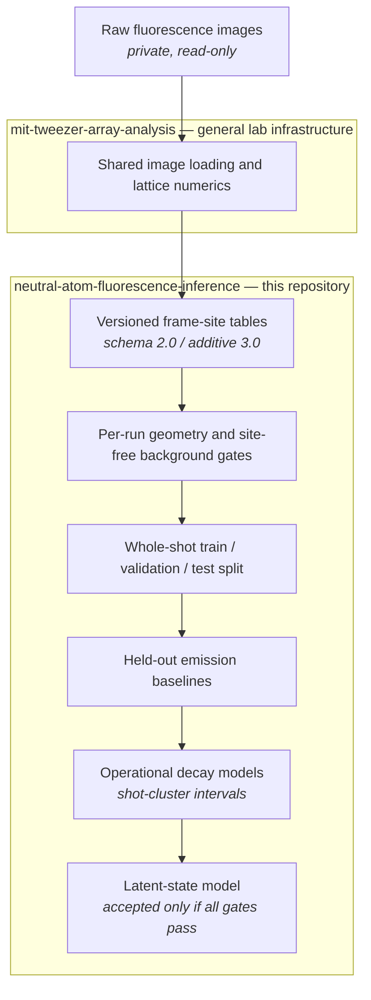
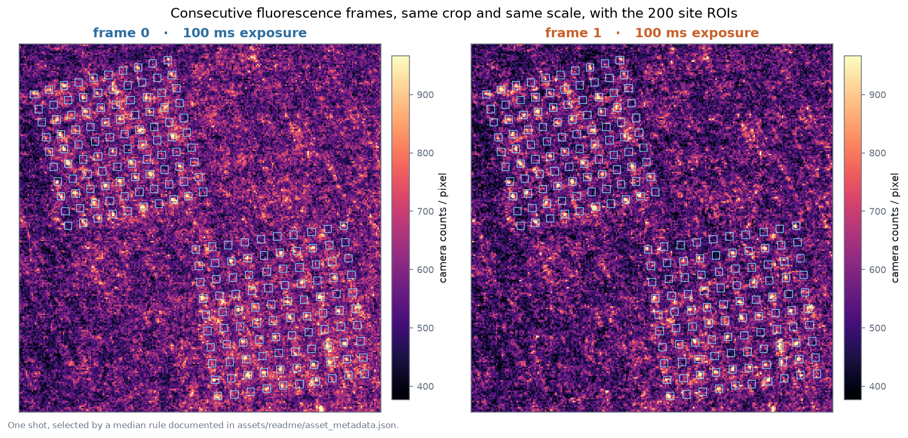
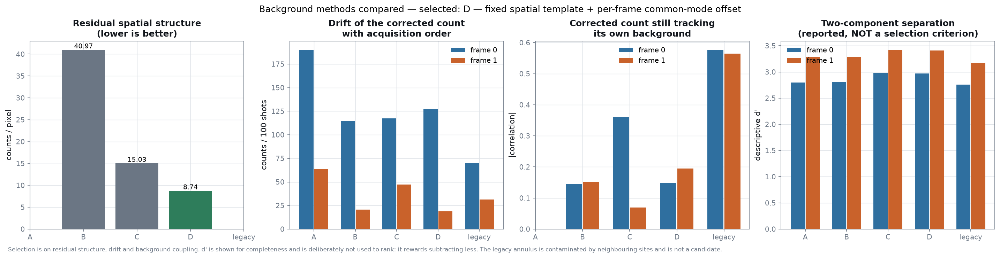
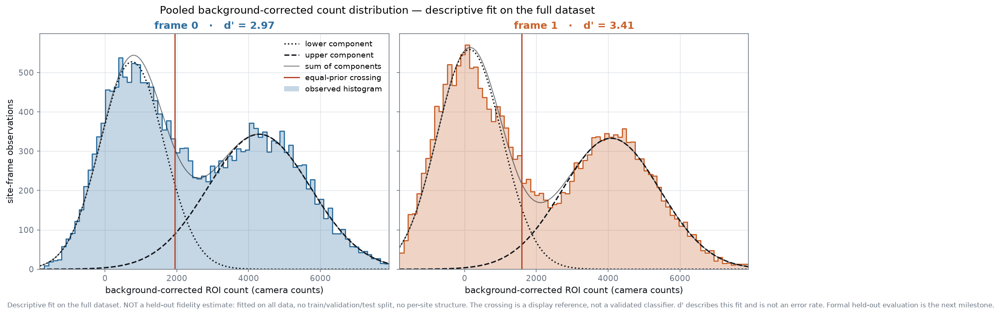
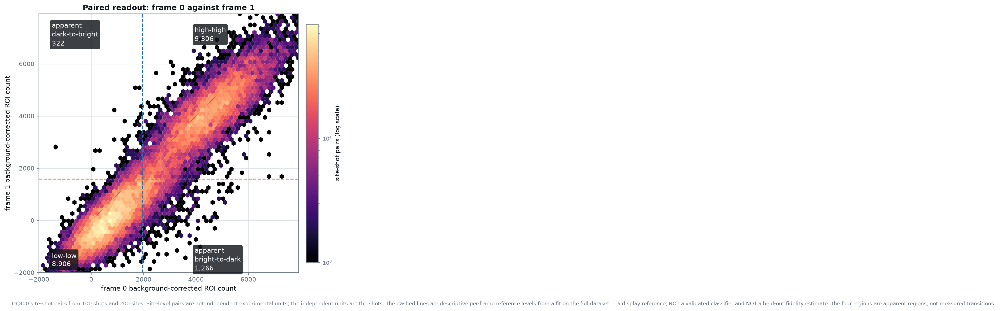
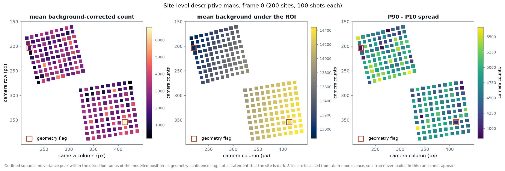
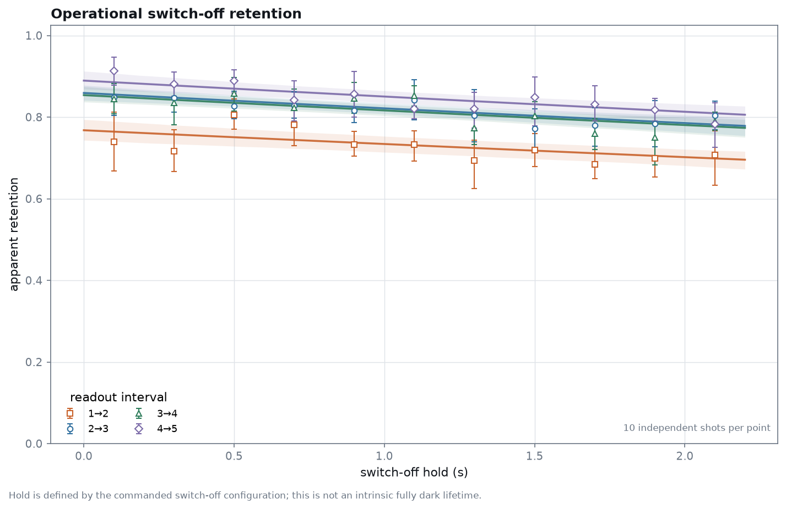
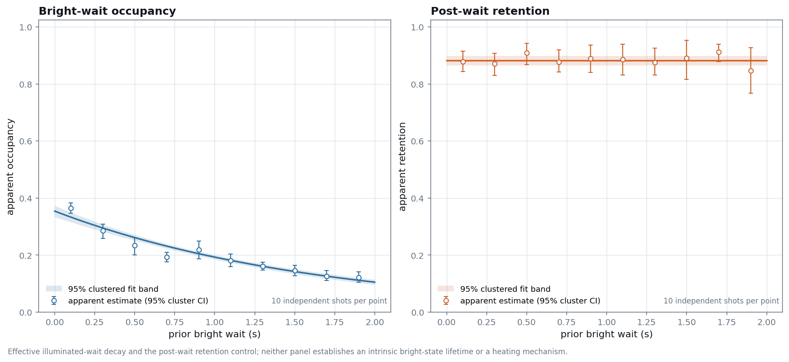
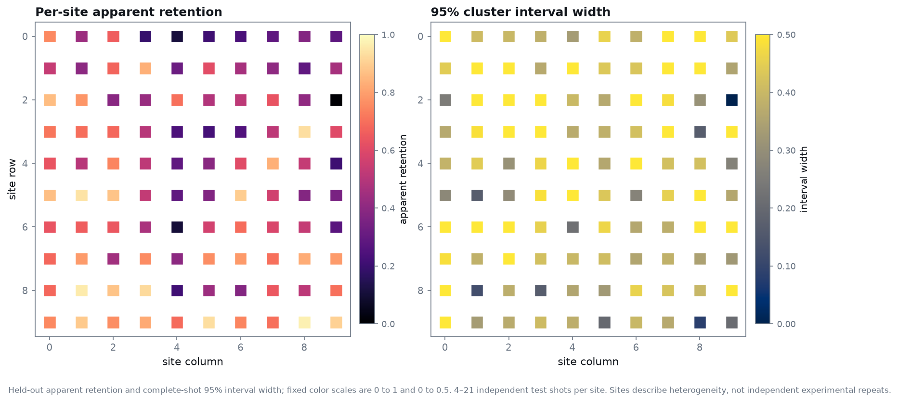

# Neutral-Atom Fluorescence Inference

Held-out statistical inference for neutral-atom fluorescence readout,
operational switch-off retention, and effective illuminated-wait decay.

<p align="center">
  
</p>

**Scientific question** — which fluorescence-count features are reproducible
on unseen shots, and what operational timing dependence remains after
per-run geometry, site-free background correction, and shot-cluster
uncertainty?

<!-- BEGIN:experiment-matrix -->
| dataset | shots | frames | exposure | swept variable |
|---|---:|---:|---:|---|
| paired readout | 100 | 2 | 100 ms | none |
| switch-off hold | 110 | 5 | 50 ms | 0.1–2.1 s |
| bright wait | 100 | 2 | 50 ms | 0.1–1.9 s |
<!-- END:experiment-matrix -->

The project now follows three linked datasets: paired 100 ms readout for
background and readout consistency; five-frame 50 ms switch-off holds for an
operational hold-time dependence and fixed interval factors; and two-frame
50 ms bright waits for an effective illuminated-wait decay and post-wait
retention control. The independent experimental unit is always a **shot**,
never a site-frame row.

**Identified quantities** — held-out predictive count likelihood,
model-implied component overlap, apparent occupancy, operational
`lambda_switch_off` and interval factors \(q_j\), effective
`lambda_bright_effective`, plus an exploratory latent-state fit whose public
acceptance gate currently fails because clustered latent-parameter uncertainty
has not been established.
These are not empirical fidelity, intrinsic dark/bright lifetimes, definitive
heating, or proof of a fixed per-pulse loss. The switch-off sequence leaves DDS
commands configured, cooling was not optimized, and sweep order is fixed
ascending within every repeated cycle.

[**Method**](#method) · [**Validation**](#validation) · [**Results**](#results) ·
[**Reproduce**](#reproduce) · [**Limitations**](#limitations) ·
[**Sweep audit**](docs/DATA_AUDIT_2026-07-28_LOSS_SWEEPS.md) ·
[**Interpretation**](docs/LOSS_SWEEP_INTERPRETATION.md) ·
[**Next experiments**](docs/NEXT_EXPERIMENTS.md) ·
[**Data contract**](docs/DATA_CONTRACT.md)

---

## Method



Image loading, ROI sums, local-background estimation and grid geometry come
from the general lab analysis package and are reused rather than reimplemented;
`tests/test_reuse_matches_lab.py` pins this repository's helpers to that
implementation numerically. This repository contains no laboratory control
code, no hardware driver, no absolute data path and no raw image. It starts at
the standardized table. The V0 paired pipeline remains schema 2.0; the two
sweeps opt into additive schema 3.0 with run-level command/timing evidence and
frozen complete-shot cycle splits.

### Locating the sites

The frozen grid corners from an earlier day do not apply to this run, and the
100-shot **mean** image is dominated by a static fringe pattern that a
high-pass trap search cannot see through. The shot-to-shot **variance** map is
the opposite: static structure contributes almost nothing, and every loaded
site becomes a compact variance excess. Both 10 × 10 sub-arrays come out
cleanly, with a sub-pixel lattice residual.

|  |
|:--|
| Two consecutive frames of one shot, identical crop and identical intensity scale, with the fitted ROIs. |

### Extracting counts

Four background methods are carried through the table in **separate columns**,
so the choice stays visible and revisable instead of being frozen into one
number: no correction, a site-free median, a robust spatial surface refitted
per frame, and a fixed spatial template plus a per-frame common-mode offset.
All of them estimate the background from pixels outside a 5 px exclusion disk
around every site. A median over the sites is never used — a change in occupied
fraction would then be absorbed into "background".

The first version of this pipeline used a 13–33 px local annulus. At a 10–11 px
site pitch that ring contains roughly ten neighbouring sites, and it showed:
its "corrected" count still tracked its own background at |r| = 0.571, it
reported a frame-to-frame shift three times too large, and it gave the *worst*
separation of any method tested. It is retained only as a diagnostic column,
named `*_annulus_contaminated`, and is not used for inference.

|  |
|:--|
| Selection is on residual spatial structure, drift with acquisition order, and whether the corrected count still tracks its own background. `d'` is shown for completeness and deliberately **not** used to rank — it rewards subtracting less. |

|  |
|:--|
| Pooled background-corrected counts per frame. **Descriptive fit on the full dataset — not a held-out fidelity estimate.** No train/validation/test split, no per-site structure; the crossing is a display reference, not a validated classifier. |

### Pairing the two readouts

|  |  |
|:--|:--|
| Every site-shot pair, with the four apparent regions. The reference lines come from a fit on the full dataset: a display reference, **not** a validated classifier. | Signal, background and spread across the array, with the geometry-flagged sites outlined. |

### Extending to the loss sweeps

Each 2026-07-28 run gets an independent 10 × 10 geometry fit. The fixed
background template and every data-dependent emission parameter are trained
on six complete acquisition cycles; two cycles select model structure and two
cycles are scored once. Every sweep condition therefore contributes 6/2/2
independent shots to train/validation/test.

The public emission baseline is selected among global, frame-pooled,
frame-offset and regularized site-offset models by validation count
likelihood. A fully independent per-site mixture is retained as a high-
parameter diagnostic. Reported overlap and \(d'\) are properties of these
count models, not empirical fidelity.

For the five-frame switch-off sweep, consecutive apparent-retention events are
fit by

\[
P(1_{j+1}\mid 1_j,t)=q_j\exp(-\lambda_\mathrm{switch\_off}t).
\]

Shared, first-interval-separate and interval-specific slopes are compared on
validation shots. For the bright-wait sweep, no-floor and floor decays are
compared, but the extra floor parameter is accepted only when its validation
gain resolves across independent shot clusters. The image-1→image-2 control is
selected separately between flat and constrained monotone retention.

All primary intervals resample complete shots within condition. Sites,
frames, and all repetitions belonging to a selected shot stay together. The
binary latent-state model is fitted only after timing, geometry, background,
held-out baseline and identifiability gates pass; its predictive improvement
does not turn posterior occupancy into empirical ground truth.

---

## Validation

The site geometry and the background correction were both fit results
presented as facts in the first pass. Round 1.5 tested them. Method and full
numbers: [`docs/VALIDATION.md`](docs/VALIDATION.md).

| Test | Result |
|---|---|
| Geometry refitted on shots 0–49 vs 50–99, optimally matched | median drift **0.080 px**, max **0.149 px**, 0 unmatched of 200 |
| Is the 10 × 10 window imposed or real? | **real** — the edge ring is 38–64× brighter than the first ring outside, and a larger fitting window finds +2.0% peaks at most |
| Are the two blocks two images of one array? | **no** — index-matched occupancy correlation −0.003 against a permuted null of −0.001 |
| The two geometry-flagged sites | one genuinely faint site, one peak-detection ambiguity; neither clipped, overlapping, or outside the valid region. Neither dropped |
| Background method | annulus **rejected**; template + per-frame offset selected on residual structure (8.74 vs 40.97 counts/px for a flat level) |
| Frame 1 − frame 0 shift, before → after | **−36.56 ± 9.94 → −12.53 ± 1.48** counts/px, now agreeing with the model-free whole-frame median (−13.77) |

The sweep-specific gates are generated independently for each run:

<!-- BEGIN:sweep-validation -->
| Gate | Switch-off hold | Bright wait |
|---|---:|---:|
| Training-shot lattice pitch | 11.205 px | 11.233 px |
| Early/late registered shift, median / max | <0.001 / <0.001 px | 0.145 / 0.258 px |
| Shortest/longest rigid-shift sensitivity | 0.007 px | 0.088 px |
| Selected background | template + frame offset | template + frame offset |
| Site-free residual structure, selected | 5.17 counts | 3.96 counts |
| Annuli intersecting neighbouring-site masks | 100 / 100 | 100 / 100 |
| Site-free first-frame pedestal | +225 ROI counts | +75 ROI counts |

The two fitted grids differ by 11.09 px, almost exactly one lattice basis
step. Recorded crop and camera settings are identical. Image data alone cannot
distinguish a real one-pitch translation from a lattice-index alias, so the
runs are not pooled.
<!-- END:sweep-validation -->

**Paired-readout-only geometry note.** For the 2026-07-27 dataset, the
validation above certifies that the two-array site set is stable, unclipped,
non-overlapping and not a duplicated image. It does **not** certify that each
site is a physically verified trap. Sites are localised from atom fluorescence,
so a trap never loaded during these 100 shots is invisible to the procedure,
and no trap-light reference image exists for this run. The phrase "200 valid
traps" appears nowhere in this repository.

One question stays open. Two sharply bounded 10 × 10 arrays with different
pitch and rotation appear in the same exposure, yet the sequence ramps the
second lattice to zero amplitude before imaging. Which potential holds each
block is unresolved; one shot with either lattice disabled from the start would
settle it. No result here depends on the answer.

---

## Results

Public numerical summaries are generated from machine-readable QC and model
results into [`reports/readme_metrics.md`](reports/readme_metrics.md), then
injected here. The V0 paired quantities remain explicitly descriptive; the
V1 sweep quantities use frozen shot splits and shot-cluster intervals. Neither
kind is an empirical fidelity or labelled physical-loss measurement.

<!-- BEGIN:results -->
### Dataset, as measured

| quantity | value |
|---|---|
| Shots | 100 |
| Frames per shot | 2 |
| Exposure per frame | 100 ms |
| Inter-frame start separation | 110 ms (100 ms exposure + 10 ms gap) |
| Sites | 200 (two 10x10 sub-arrays) |
| ROI | 25 px per site |
| Site-frame observations | 40,000 |
| Site-shot pairs | 20,000 |
| Rows carrying a quality flag | 400 |
| Sites with a geometry flag | 2 of 200 |
| Lattice fit residual (median / P95) | 0.47 / 0.82 px |
| Saturated ROI pixels | 0 |
| Brightest pixel seen | 2,037 of 65,535 ADU |

### Frame-dependent background

| quantity | value |
|---|---|
| Frame 1 minus frame 0, template + offset (primary) | -12.53 ± 1.48 counts/px |
| Frame 1 minus frame 0, global site-free median | -12.92 ± 1.69 counts/px |
| Frame 1 minus frame 0, legacy annulus (contaminated) | -36.56 ± 9.94 counts/px |
| Background level under a ROI, frame 0 (primary) | 550.9 counts/px |
| Legacy annulus level, frame 0 | 591.6 counts/px |

The two site-masked estimators agree with each other to 0.4 counts/px and with
the whole-frame median shift. The legacy annulus reports a shift about three
times larger, with seven times the spread: at a 10–11 px site pitch its 13–33 px
ring contains roughly ten neighbouring sites, so part of what it calls
"background" is array light that itself changes between the frames. It is kept
as a diagnostic column and is not used for inference.

### Paired-readout agreement

| quantity | value |
|---|---|
| Paired-readout agreement | 91.98% (95% shot-cluster bootstrap 91.59–92.38%) |
| Apparent bright-to-dark | 11.98% |
| Apparent dark-to-bright | 3.49% |
| Above reference, frame 0 | 53.39% |
| Above reference, frame 1 | 48.63% |

Agreement is computed against per-frame descriptive reference levels.
"Apparent" is meant literally: this run has no matched-empty, dark-frame or
natural-loss control, so a disagreement cannot be assigned to atom loss rather
than to misclassification.

### Measurement variants

| variant | definition | frame | d' | model-implied overlap | drift / 100 shots |
|---|---|---|---|---|---|
| A | no correction | 0 | 2.80 | 8.3% | +190 |
| A | no correction | 1 | 3.29 | 5.1% | +64 |
| B | site-free median | 0 | 2.81 | 8.2% | +115 |
| B | site-free median | 1 | 3.29 | 5.0% | +21 |
| C | spatial surface | 0 | 2.98 | 7.0% | +117 |
| C | spatial surface | 1 | 3.42 | 4.4% | +47 |
| D | template + offset | 0 | 2.97 | 7.1% | +127 |
| D | template + offset | 1 | 3.41 | 4.4% | +19 |

`d'` and the overlap describe the descriptive two-component fit. They are
**not** a readout fidelity, a false-positive rate or a false-negative rate.

### Representative example used in the README assets

- **Shot:** shot whose mean frame-0 raw ROI count is closest to the run median, excluding shot 0 (documented background outlier) → shot order 50.
- **Site:** unflagged site whose mean frame-0 background-corrected count is closest to the median across sites → site 160
  (grid_B, row 6, column 0).
<!-- END:results -->

### Held-out loss-sweep inference

|  |
|:--|
| Curves and 95% intervals use complete shots as clusters. The fixed ascending order inside every acquisition cycle remains a design limitation. |

<!-- BEGIN:loss-sweep-results -->
Generated loss-sweep results are populated by
`scripts/generate_loss_sweep_assets.py` after
`reports/loss_sweep_results.json` exists.
<!-- END:loss-sweep-results -->

|  |  |
|:--|:--|
| Apparent consecutive-readout retention under the switch-off command. DDS settings remain configured, so this is not an intrinsic dark lifetime. | Image-1 apparent occupancy during the commanded illuminated wait. The selected rate is effective and condition-specific. |

|  |  |
|:--|:--|
| Site-free background estimates, separate from the occupancy-dependent trap-count low tail. | Test-shot apparent retention by lattice site; spatial heterogeneity is not additional independent-shot evidence. |

---

## Reproduce

```bash
git clone https://github.com/niu1298/neutral-atom-fluorescence-inference.git
cd neutral-atom-fluorescence-inference
python -m venv .venv && .venv/Scripts/python -m pip install -e ".[dev]"
cp configs/local.example.toml configs/local.toml   # then edit for your machine
```

Then, in order:

```bash
python scripts/audit_source_data.py         --config configs/paired_100ms.yaml
python scripts/export_processed_dataset.py   --config configs/paired_100ms.yaml
python scripts/validate_site_geometry.py     --config configs/paired_100ms.yaml
python scripts/compare_background_methods.py --config configs/paired_100ms.yaml
python scripts/generate_readme_assets.py     --config configs/paired_100ms.yaml

python scripts/audit_source_data.py --config configs/dark_hold_50ms_20260728_0044.yaml
python scripts/audit_source_data.py --config configs/bright_wait_50ms_20260728_0050.yaml
python scripts/export_processed_dataset.py   --config configs/dark_hold_50ms_20260728_0044.yaml
python scripts/export_processed_dataset.py   --config configs/bright_wait_50ms_20260728_0050.yaml
python scripts/validate_sweep_geometry.py
python scripts/compare_loss_sweep_backgrounds.py
python scripts/analyze_loss_sweeps.py --bootstrap 1000
python scripts/generate_loss_sweep_assets.py
python -m pytest
```

In order: the data audit; the standardized table (schema 2.0) plus the QC
report; the geometry gate, which exits non-zero if it fails; the background
comparison, which reports whether the configured primary method matches what
the evidence recommends; and every asset on this page plus the metrics above.
Each script fails with an actionable message when the raw shots are
unavailable; none of them substitutes synthetic data for a missing
measurement.

The sweep commands add schema-3.0 tables, independent per-run geometry gates,
the site-free background comparison, held-out/clustered operational models, the
latent acceptance gate, and the generated sweep figures and metrics. Their
default 1,000-replicate analysis is deterministic under the recorded seed.

`notebooks/01_data_qc.ipynb` is a presentation layer over the same package. No
asset and no number in this repository depends on running it.

Raw shots live under `Experiment-Data/<date>/<sequence>/` and are gitignored,
as are the processed table and the QC report. Provenance — git commit, config
hash and input-manifest hash — is recorded in processed-table metadata and the
machine-readable audit, validation and model reports. The asset manifest binds
public figures to their machine-readable result inputs. Machine paths never
appear in tracked outputs.

---

## Limitations

The full claim table is
[`docs/LOSS_SWEEP_INTERPRETATION.md`](docs/LOSS_SWEEP_INTERPRETATION.md).

**Paired 100 ms readout.** This dataset identifies count separation,
frame-dependent background and apparent paired agreement. With one condition,
two frames and no labelled controls, it still has no identifying information
for:

- a true false-positive or false-negative rate, or a readout fidelity —
  mixture overlap is a property of the fitted description, not a measured error
  rate;
- an imaging-induced loss rate — frame-to-frame disagreement mixes real loss
  with misclassification in both frames, and the apparent dark-to-bright rate
  is large enough to prove the misclassification term is not negligible;
- **when** an atom was lost, if it was: during frame 0, during the 10 ms gap,
  or during frame 1;
- an optimal exposure time — the array is nowhere near detector saturation, but
  that is not an exposure-time optimisation;
- generalisation to another day.

**Known data issues**, all recorded in [`docs/DATA_AUDIT.md`](docs/DATA_AUDIT.md)
and none of them silently repaired: frame 1 sits systematically below frame 0
by 12.5 counts/px;
the common-mode level is not stationary within the 231 s run; shot 0 is a
first-shot background outlier and is kept, not dropped; and two of 200 sites
carry a geometry-confidence flag. Sites are localised from atom fluorescence,
so a trap never loaded during these 100 shots could not be localised at all.

**Loss sweeps.** Multi-frame inference is now in scope, but only operationally
and under the stated models:

- the nominal dark hold commands the science-imaging switches off while DDS
  frequency and amplitude commands remain configured; without an extinction
  measurement, `tau_switch_off` is not an intrinsic dark lifetime;
- cooling was not optimized, so neither effective rate is a best-case
  apparatus benchmark;
- both sweeps are from one date with ten independent shots per condition;
- all sites in a shot share loading, illumination, background, timing and
  drift, so site rows are not independent repeats;
- there is no empirical occupancy ground truth, matched-empty sequence,
  complete camera dark-frame control or pre/post nondestructive reference;
- condition order is fixed ascending inside all ten cycles. Condition is
  perfectly confounded with within-cycle position even though cycles repeat;
- the first switch-off frame has a large pedestal. Site-free pixels show
  +225 ROI counts, while the prototype trap-low-tail method reported +1,114;
- the two runs differ by one lattice pitch and have different background
  trajectories, so their rates are compared but not pooled;
- \(q_j\) mixes fixed physical loss, classification error, sequence transients
  and state selection;
- the exploratory latent model improves ordinary held-out likelihood, but its
  profile and diagnostics treat site trajectories with working independence.
  Without complete-shot clustered latent-parameter uncertainty, its public
  gate fails and no posterior trajectory is promoted as a result.

The comparison with 50 ms of effective bright-wait decay supports only this
statement: **the simple constant-rate bright-wait model does not explain the
full apparent inter-readout loss.** It does not prove a fixed per-exposure or
fixed per-pulse mechanism.

---

## Status

| Milestone | State |
|---|---|
| V0 data audit | done — [`docs/DATA_AUDIT.md`](docs/DATA_AUDIT.md) |
| 2026-07-28 sweep audit | done — [`docs/DATA_AUDIT_2026-07-28_LOSS_SWEEPS.md`](docs/DATA_AUDIT_2026-07-28_LOSS_SWEEPS.md) |
| Standardized data layer, schema 2.0 | preserved — [`docs/DATA_CONTRACT.md`](docs/DATA_CONTRACT.md) |
| Image-level QC and background variants | done |
| Geometry validation and background remediation | done — [`docs/VALIDATION.md`](docs/VALIDATION.md) |
| Additive schema 3.0 sweep exports | done — [`docs/DATA_CONTRACT.md`](docs/DATA_CONTRACT.md) |
| Shot-grouped 60/20/20 held-out sweep baselines | done |
| Shot-cluster operational loss models | done |
| Five-frame latent-state gate | not accepted; complete-shot clustered latent uncertainty is missing |
| Identification controls: matched-empty, dark frames, natural-loss | data not yet acquired |
| Exposure-duration, pulse-count and cross-day controls | designed — [`docs/NEXT_EXPERIMENTS.md`](docs/NEXT_EXPERIMENTS.md) |

Until the identifying controls exist, no result here is labelled empirical
fidelity, true imaging-loss probability, intrinsic lifetime, definitive
heating or a proven fixed pulse cost.

## Layout

```
configs/     tracked machine-independent config; local paths stay untracked
docs/        data audit, validation report, repository-boundary data contract
src/         schema, extraction, held-out emissions, clustered sweep and latent models
scripts/     audit, export, validation, inference and deterministic asset generation
notebooks/   presentation only
tests/       schema, splits, timing, geometry, background, recovery,
             leakage guards, determinism, privacy and lab-parity
reports/     generated QC/model results and the README metric fragment
assets/      generated README figures and the hero animation
```

## License

MIT — see [LICENSE](LICENSE).
