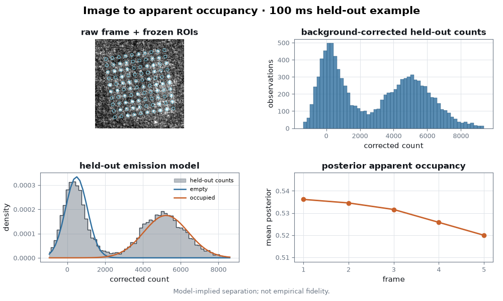
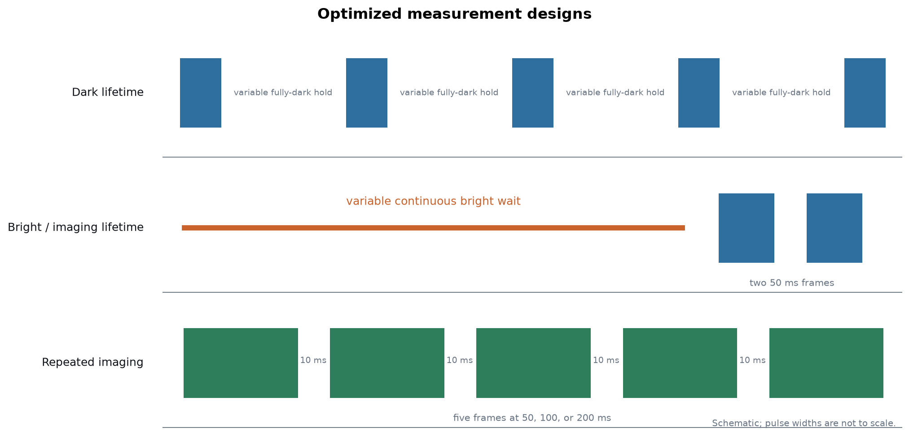
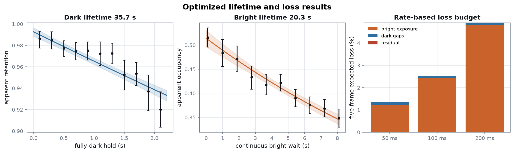
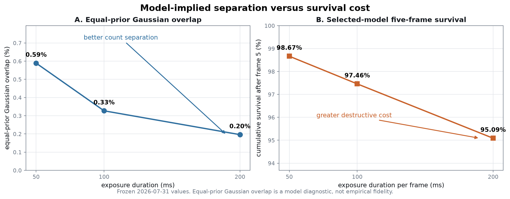

# Neutral-Atom Fluorescence Inference

From raw fluorescence images to held-out latent-occupancy inference,
operational lifetimes, and repeated-imaging loss attribution.

[**Inference**](#from-images-to-apparent-occupancy) ·
[**Measurements**](#what-was-measured) ·
[**Results**](#main-results) ·
[**Trade-off**](#readout-quality-versus-survival-cost) ·
[**Repeated imaging**](#repeated-imaging-and-pulse-segmentation) ·
[**Statistics**](#statistical-contribution) ·
[**Reproduce**](#reproduce) ·
[**Limitations**](#limitations)

## From images to apparent occupancy

A camera frame becomes a measurement only after training-fitted lattice
geometry defines the site ROIs, a site-free background estimate is removed,
and an exposure-specific latent-class model maps corrected counts to posterior
occupied probability.

<p align="center">
  <picture>
    <source srcset="assets/readme/optimized_occupancy_inference.gif" type="image/gif">
    
  </picture>
</p>

The walkthrough uses the optimized 100 ms repeated-imaging test split. Its
representative shot and site are selected by deterministic median rules, not
visual quality. Geometry, background, and emission outputs are frozen before
the visual is generated.

The empty and occupied classes are not externally labelled. The output is
therefore **apparent occupancy** under a **held-out emission model**.
Separation and overlap are model-implied, **not empirical fidelity**.

The eight stages keep raw signal, preprocessing, statistical inference, and
survival interpretation visually distinct. A paused frame still identifies
the active stage and the frozen 100 ms condition, so the fallback image and
animation tell the same scientific story without relabelling the older paired
dataset.

The independent experimental unit throughout is a complete shot, never an
individual site-frame observation.

## What was measured

Five optimized acquisitions contain 720 complete shots. Two measure
operational lifetime under varied dark or illuminated waits; three measure
five-frame imaging at 50, 100, and 200 ms exposure.

| Measurement | Shots | Frames | Exposure | Experimental variation |
|---|---:|---:|---:|---|
| bright lifetime | 200 | 2 | 50 ms | illuminated wait 0.1–8.1 s |
| dark lifetime | 220 | 5 | 50 ms | fully-dark hold 0.1–2.1 s |
| repeated imaging | 100 | 5 | 50 ms | fixed five-frame sequence |
| repeated imaging | 100 | 5 | 100 ms | fixed five-frame sequence |
| repeated imaging | 100 | 5 | 200 ms | fixed five-frame sequence |



All expected frames are present, geometry and background gates pass
independently for every run, and the declared interframe dark gap in repeated
imaging is 10 ms. Full acquisition and validation evidence is in the
[optimized data audit](docs/DATA_AUDIT_2026-07-31_OPTIMIZED_LIFETIMES.md).

## Main results

The selected models resolve distinct operational dark and bright hazards and
favor a continuous-only explanation of the repeated-imaging data. Lifetime
parentheses are 95% complete-shot intervals.

| Quantity | Selected result |
|---|---|
| dark operational lifetime | **35.73 s** (32.09–40.26 s) |
| bright operational lifetime | **20.30 s** (17.94–23.56 s) |
| model-implied overlap | **0.59% / 0.33% / 0.20%** at 50 / 100 / 200 ms |
| selected-model predicted five-frame survival | **98.67% / 97.46% / 95.09%** at 50 / 100 / 200 ms |
| pulse segmentation | no material additional pulse term selected |



These are operational results for the recorded sequences, not intrinsic or
best-achievable apparatus limits. The post-wait control is flat: no trend with
the preceding illuminated wait is resolved.

## Readout quality versus survival cost

Longer exposure separates the fitted count components more clearly, but it
also leaves less selected-model survival after five frames. The figure places
both effects on the same exposure axis without converting count overlap into a
labelled error rate.



At 50, 100, and 200 ms, overlap decreases from 0.59% to 0.20% while predicted
five-frame survival decreases from 98.67% to 95.09%. This is the central
measurement-design trade-off: more photons improve model-implied separation,
while longer illumination increases destructive cost.

## Repeated imaging and pulse segmentation

The repeated-imaging analysis compares a continuous-only model with models
that add a pulse-associated retention factor. Validation selects the
continuous-only structure.

The extra pulse term produces a small positive held-out likelihood improvement,
but it does not clear the predeclared materiality threshold. Direct
matched-total-exposure contrasts—2×50 versus 1×100, 4×50 versus 2×100 versus
1×200, and 4×100 versus 2×200—also have complete-shot intervals that cross
zero.

Accordingly, the public pulse-loss claim gate remains closed. The conditional
pulse factor is retained as model-structure sensitivity, not promoted over the
selected model.

The selected five-frame loss budget attributes approximately 1.22%, 2.43%,
and 4.80% to illuminated exposure at 50, 100, and 200 ms, with about 0.11%
from the four dark gaps. The residual pulse term is zero by selected-model
structure, not a precisely measured physical zero.

Exact contrasts and the retained segmentation figure are in the
[optimized results](docs/OPTIMIZED_LIFETIME_RESULTS.md) and
[exposure-segmentation figure](assets/readme/exposure_segmentation_result.png).
Segment attribution and its limits are defined in
[Loss decomposition](docs/LOSS_DECOMPOSITION.md).

## Statistical contribution

- **Latent-class inference without external labels:** report apparent
  occupancy, model-implied separation, and explicit claim boundaries.
- **Frozen train/validation/test model selection:** learn preprocessing and
  candidates on training data, select structure on validation, and score the
  final test shots once.
- **Complete-shot and block-bootstrap uncertainty:** preserve clustered sites
  and frames while separately testing sensitivity to acquisition-order drift.
- **Materiality-aware model selection:** require an added term to improve
  held-out prediction enough to matter, not merely become detectable in a
  large correlated table.

The complete estimand, likelihood, resampling, and model-gate definitions are
in [Statistical methods](docs/STATISTICAL_METHODS.md).

## Reproduce

After configuring the local raw-data roots, run the optimized workflow from
the repository root:

```powershell
.\.venv\Scripts\python.exe scripts\reproduce_optimized_lifetimes.py
```

The command audits the five acquisitions, builds the standardized local
products, validates frozen preprocessing, and regenerates the reviewed
scientific result. Publication-only figures can then be regenerated without
refitting the scientific models:

```powershell
.\.venv\Scripts\python.exe scripts\generate_optimized_assets.py
```

Detailed prerequisites and the preserved 2026-07-28 benchmark workflow are in
[Reproduction](docs/REPRODUCE.md). The reviewed values and full robustness
tables are in [Optimized results](docs/OPTIMIZED_LIFETIME_RESULTS.md). The
[2026-07-28 analysis](docs/LOSS_SWEEP_INTERPRETATION.md) remains a reproducible
pre-optimization benchmark and is not mixed into the results above.

## Limitations

- Occupancy is latent; model-implied overlap is not empirical fidelity.
- Each exposure corresponds to one acquisition run, so exposure and run are
  partly confounded.
- Fixed within-cycle ordering cannot eliminate a drift aligned perfectly with
  experimental condition.
- Integrated frames do not reveal an exact loss time; bright/dark attribution
  is probabilistic and rate-based.
- Transferring the bright-lifetime hazard into repeated imaging remains a
  tested sensitivity rather than a universal physical assumption.

MIT licensed. See [LICENSE](LICENSE).
