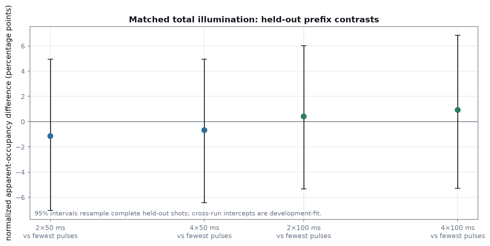

# Neutral-Atom Fluorescence Inference

From raw fluorescence images to held-out latent-occupancy inference, operational lifetimes, and repeated-imaging loss attribution.

[**Inference**](#from-images-to-apparent-occupancy) ·
[**Results**](#main-results) ·
[**Experiments**](#experiments-and-timing) ·
[**Repeated imaging**](#repeated-imaging-and-loss-attribution) ·
[**Methods**](#statistical-design) ·
[**Reproduce**](#reproduce) ·
[**Limitations**](#limitations)

## From images to apparent occupancy

Each run gets its own training-only lattice geometry and site-free background
model. Corrected site counts are then mapped to posterior occupied
probabilities with an exposure-specific latent-class emission model. The
independent experimental unit is a complete shot, never an individual site.


The occupied and empty classes are not externally labelled. Accordingly, this
repository reports **apparent occupancy**, model-implied component overlap,
and posterior entropy. It does not convert overlap into empirical readout
fidelity or treat a posterior transition as an observed loss timestamp.

## Main results

The optimized 2026-07-31 data resolve two operational hazards under the
recorded conditions and support a continuous-only description of the three
five-frame acquisitions. Parentheses are 95% complete-shot cluster-bootstrap
intervals.

| Quantity | Selected result | Interpretation |
|---|---:|---|
| dark operational lifetime | **35.73 s** (32.09–40.26 s) | commanded fully-dark holds |
| bright operational lifetime | **20.30 s** (17.94–23.56 s) | continuous recorded illumination |
| post-wait frame-1→frame-2 control | flat; `q₀ = 0.98834` (0.98569–0.99072) | no resolved trend with prior bright wait |
| repeated-imaging model | continuous-only | pulse factor did not clear the held-out materiality gate |


The lifetime parameters are operational, not intrinsic apparatus limits. The
dark estimate uses the experimenter-confirmed fully-dark intervals; the bright
estimate applies to the recorded illuminated-wait sequence. Neither result is
an optimized hardware specification.

### Held-out emission diagnostics

Validation independently selected a five-fold, site-offset shrinkage emission
model at every exposure. The final test split was scored once.

| Exposure | Test rows | Mean NLL | d-prime | Model-implied overlap | Posterior entropy |
|---:|---:|---:|---:|---:|---:|
| 50 ms | 10,000 | 8.1804 | 4.800 | 0.589% | 0.01362 |
| 100 ms | 10,000 | 8.8860 | 5.108 | 0.327% | 0.01366 |
| 200 ms | 10,000 | 9.4609 | 5.423 | 0.196% | 0.01163 |

Validation-only checks found no weak sites and no evidence strong enough to
justify a third count state or heavy-tail component. Exposure-specific models
are retained: thresholds are not shared across 50, 100, and 200 ms frames.

## Experiments and timing

Five acquisitions contain 720 complete shots and 300,000 frame-site rows after
standardization. All expected frames are present, all compiled-command timing
audits pass, and no science frame has saturated or non-finite pixels.

| Measurement | Shots | Frames | Exposure | Varied timing | Frozen split |
|---|---:|---:|---:|---|---:|
| bright lifetime | 200 | 2 | 50 ms | wait 0.1–8.1 s | 120 / 40 / 40 |
| dark lifetime | 220 | 5 | 50 ms | hold 0.1–2.1 s | 132 / 44 / 44 |
| repeated imaging | 100 | 5 | 50 ms | fixed sequence | 60 / 20 / 20 |
| repeated imaging | 100 | 5 | 100 ms | fixed sequence | 60 / 20 / 20 |
| repeated imaging | 100 | 5 | 200 ms | fixed sequence | 60 / 20 / 20 |


For repeated imaging, prefix `N` contains `N × exposure` of cumulative bright
time and `(N − 1) × 10 ms` of cumulative dark time. Compiled frame starts add
2 µs of command-update overhead; that overhead is recorded separately and is
not silently added to the physical dark interval.

Geometry is fitted independently from training shots for all five runs. The
early/late or start/end refits, registration checks, and residual-distortion
gates all pass. Training-only background selection chooses a robust spatial
surface for the 50 ms repeated run and a fixed template plus per-frame offset
for the other four runs.

The complete source, sequence, geometry, and background evidence is in the
[optimized data audit](docs/DATA_AUDIT_2026-07-31_OPTIMIZED_LIFETIMES.md).

## Repeated imaging and loss attribution

### Apparent occupancy by frame

All-shot descriptive occupancy falls across the five frames. Intervals below
resample complete shots; they describe the selected latent-class observation
model, not labelled survival outcomes.

| Exposure | Frame 1 | Frame 2 | Frame 3 | Frame 4 | Frame 5 |
|---:|---:|---:|---:|---:|---:|
| 50 ms | 0.5282 | 0.5248 | 0.5227 | 0.5185 | 0.5170 |
| 100 ms | 0.5336 | 0.5260 | 0.5211 | 0.5160 | 0.5108 |
| 200 ms | 0.5260 | 0.5145 | 0.5049 | 0.4960 | 0.4885 |

The selected continuous-only model predicts cumulative survival after frame 5
of 0.9867, 0.9746, and 0.9509 at 50, 100, and 200 ms. Those values combine the
separately estimated bright and dark hazards while retaining a run-specific
initial loading probability.

### Matched-total-bright-time contrasts

The held-out, model-normalized complete-shot contrasts do not resolve a
segmentation effect at fixed total bright time.

| Total bright time | Comparison to least-segmented prefix | Difference (95% interval) |
|---:|---|---:|
| 100 ms | 2×50 vs 1×100 | −1.14 pp (−7.04 to 4.95 pp) |
| 200 ms | 4×50 vs 1×200 | −0.67 pp (−6.43 to 4.95 pp) |
| 200 ms | 2×100 vs 1×200 | +0.41 pp (−5.34 to 6.01 pp) |
| 400 ms | 4×100 vs 2×200 | +0.93 pp (−5.28 to 6.84 pp) |



The pulse-associated model improves validation mean NLL by
`4.88 × 10⁻⁵` per row, below the predeclared `1 × 10⁻⁴` materiality threshold,
so the public pulse-loss claim gate remains closed. As an explicitly
unselected sensitivity, that model estimates per-pulse survival
`q = 0.99428`, with complete-shot and block-bootstrap intervals that exclude
one. Model selection takes precedence over that conditional estimate.

### Primary five-frame loss budget

For the selected continuous-only model, the probability budget after all five
frames is:

| Exposure | Bright-segment loss | Dark-gap loss | Residual pulse term | Final survival |
|---:|---:|---:|---:|---:|
| 50 ms | 1.223% | 0.111% | 0% by structure | 98.666% |
| 100 ms | 2.431% | 0.111% | 0% by structure | 97.458% |
| 200 ms | 4.803% | 0.109% | 0% by structure | 95.088% |

These are rate-based prior attributions over sequence segments. Integrated
frames reveal neither an exact loss time nor a count-conditioned posterior
location. The unselected pulse model's nonzero residual term is reported only
as model-structure sensitivity in the
[loss-decomposition document](docs/LOSS_DECOMPOSITION.md).

## Statistical design

- Splits are frozen by complete acquisition cycles or chronological shots;
  geometry, background, and emission fitting use training data only,
  validation selects structure, and final test shots are scored once.
- Lifetime intervals and primary repeated-imaging intervals use 1,000
  complete-shot cluster-bootstrap replicates. A contiguous-block bootstrap
  preserves slow shot-order drift as a separate sensitivity.
- Dark and bright hazards enter survival multiplicatively. Exposure runs keep
  separate initial loading, and matched-prefix comparisons condition on equal
  cumulative bright time while accounting for each 10 ms dark gap.
- Public claims require held-out improvement, a predeclared materiality gate,
  stable clustered uncertainty, and agreement across background, split, and
  drift sensitivities. Full definitions are in
  [Statistical methods](docs/STATISTICAL_METHODS.md).

## Reproduce

After configuring the local raw-data roots, the optimized analysis is
reproduced with one command from the repository root:

```powershell
.\.venv\Scripts\python.exe scripts\reproduce_optimized_lifetimes.py
```

The command audits and exports all five datasets, refits training-only geometry
and backgrounds, performs the frozen analysis with 1,000 bootstrap replicates,
and writes the reviewed result. It refuses publication from dirty scientific
code. Detailed prerequisites, output contracts, and the preserved V0/V1
commands are in [Reproduction](docs/REPRODUCE.md).

The reviewed machine-readable result is
[`reports/optimized_lifetime_results_20260731.json`](reports/optimized_lifetime_results_20260731.json).
The publication manifest binds that result to the analysis commit, inputs,
documents, environment, and exact same-environment asset hashes.

## Documentation

- [Optimized result interpretation](docs/OPTIMIZED_LIFETIME_RESULTS.md) — full
  estimates, held-out scores, intervals, and sensitivity boundaries.
- [Statistical methods](docs/STATISTICAL_METHODS.md) — estimands, splits,
  likelihoods, model gates, and clustered uncertainty.
- [Loss decomposition](docs/LOSS_DECOMPOSITION.md) — segment probabilities,
  matched-prefix identification, and location limits.
- [Optimized data audit](docs/DATA_AUDIT_2026-07-31_OPTIMIZED_LIFETIMES.md) —
  source completeness, exact timing, geometry, background, and data contract.
- [2026-07-28 pre-optimization benchmark](docs/LOSS_SWEEP_INTERPRETATION.md) —
  retained for reproducibility and historical comparison, not mixed into the
  optimized estimates above.

## Limitations

- Occupancy is latent: there are no external per-site labels, so model overlap
  is not empirical fidelity and apparent loss is model-dependent.
- Each exposure has one acquisition run; exposure and run remain partly
  confounded, and fixed within-cycle ordering cannot eliminate aligned drift.
- Optical extinction and exact atom-loss times were not measured. Loss
  location is therefore probabilistic segment attribution, not event timing.
- The 0090 bright-lifetime run differs in pre-heat commands, so transferring
  its hazard to repeated imaging is tested as a sensitivity rather than assumed
  universal.

## License

MIT. See [LICENSE](LICENSE).
