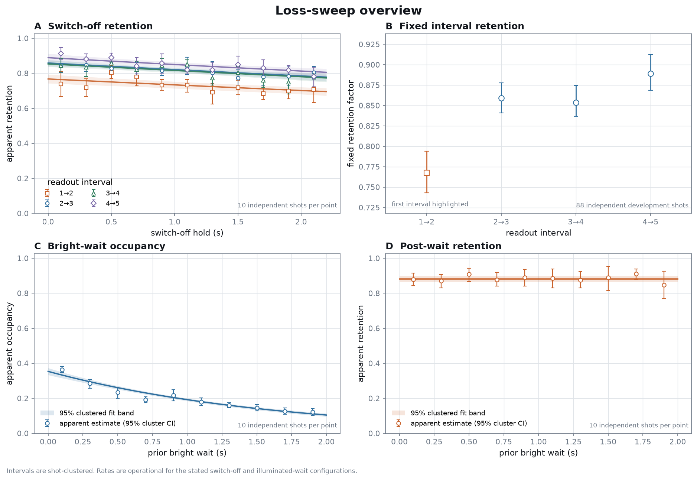
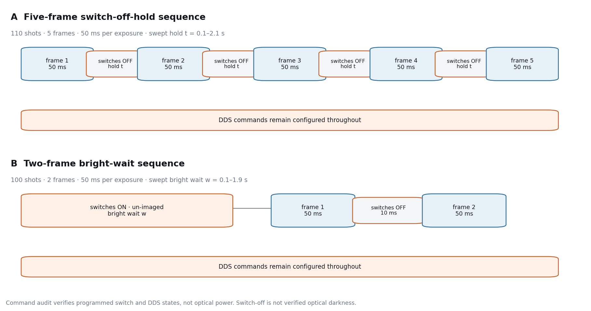
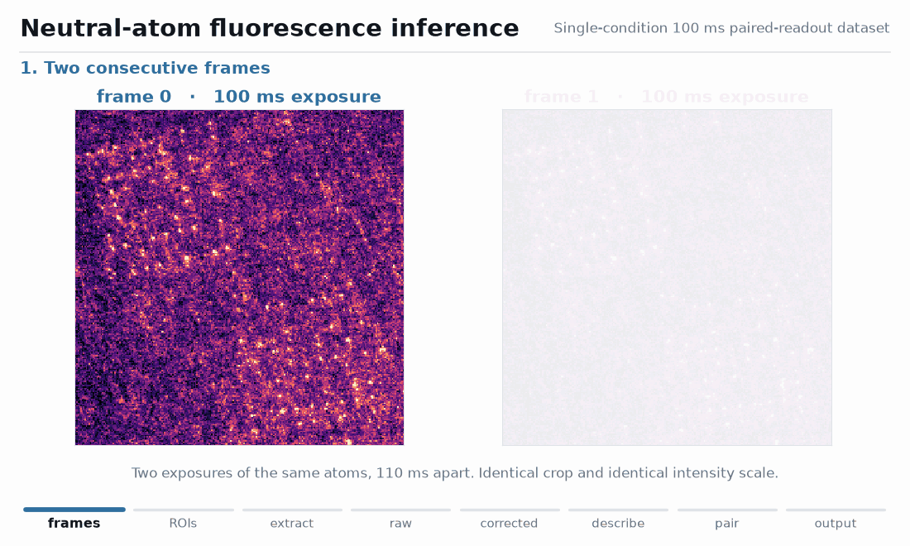
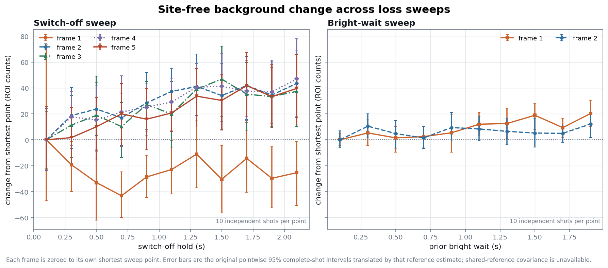

# Neutral-Atom Fluorescence Inference

Held-out statistical inference for neutral-atom fluorescence readout,
operational switch-off retention, and effective illuminated-wait decay.

**Scientific question** — which fluorescence-count features generalize to
unseen shots, and what timing dependence remains after per-run geometry,
site-free background correction, and complete-shot uncertainty?

**Analysis path** — raw fluorescence → held-out occupancy inference →
operational switch-off retention → effective bright-wait decay → a
predicted-versus-observed loss comparison whose mechanism remains unidentified.

[**Main result**](#main-result) · [**Experiments**](#experiments) ·
[**Method**](#method-and-data-pipeline) · [**Robustness**](#background-and-robustness) ·
[**Reproduce**](#reproduce) · [**Limitations**](#limitations)

## Main result

<!-- BEGIN:loss-sweep-results -->
| headline quantity | estimate (95% complete-shot cluster CI) |
|---|---:|
| `tau_switch_off` | 22.29 s (15.57–33.15 s) |
| `tau_bright_effective` | 1.64 s (1.50–1.83 s) |
| observed − predicted 50 ms apparent-loss gap | 10.26 percentage points (8.62–11.79 percentage points) |

The simple constant-rate bright-wait model does not explain the full apparent inter-readout loss. This does not establish a fixed per-pulse mechanism.
<!-- END:loss-sweep-results -->

`tau_switch_off` is an operational lifetime under the commanded switch-off
configuration: the switches are commanded off while DDS frequency and
amplitude commands remain configured, and realized optical extinction was not
measured. `tau_bright_effective` is specific to the illuminated-wait
configuration. Cooling was not optimized.

|  |
|:--|
| Points summarize all 10 shots per condition; selected structures and fitted bands follow the frozen train/validation workflow. Intervals use complete shots as clusters. |

The sweep points were acquired in fixed ascending order within each repeated
cycle. Complete-shot clustering captures repeat variability, but it cannot
separate a timing effect from an unexplained drift locked to within-cycle
position.

The observed-minus-predicted gap does not identify why the two operational
sequences differ. A fixed per-pulse cost, switching transient, state selection,
classification error, nonstationary heating, or another sequence difference
could contribute.

## Experiments

<!-- BEGIN:experiment-matrix -->
| dataset | shots | frames | exposure | swept variable |
|---|---:|---:|---:|---|
| paired readout | 100 | 2 | 100 ms | none |
| switch-off hold | 110 | 5 | 50 ms | 0.1–2.1 s |
| bright wait | 100 | 2 | 50 ms | 0.1–1.9 s |
<!-- END:experiment-matrix -->

|  |
|:--|
| Commanded sequence timing. “Switch-off” describes the switch command, not demonstrated optical darkness; the DDS commands remain configured during the hold. |

The paired 100 ms dataset establishes the extraction and background baseline.
The five-frame 50 ms dataset probes retention versus commanded switch-off
hold. The two-frame 50 ms dataset probes apparent occupancy after an
illuminated wait and separately checks image-1→image-2 retention.

Exact shot order, commanded timing, HDF5 evidence, switch levels, and DDS
constancy are recorded in the
[loss-sweep data audit](docs/DATA_AUDIT_2026-07-28_LOSS_SWEEPS.md).

## Method and data pipeline

The package implements one reproducible path:

1. Load raw fluorescence without modifying or publishing the HDF5 shots.
2. Fit and validate geometry independently for each run.
3. Estimate background from site-free pixels and retain every correction
   variant as a separate standardized-table column.
4. Freeze complete-shot train/validation/test splits within every sweep point;
   fit on train, select structure on validation, and score test once.
5. Fit operational retention models and resample complete shots within
   condition for uncertainty.

<p align="center">
  
</p>

This animation is the **paired 100 ms pipeline example**, not the scientific
result for the whole repository. It shows how raw images become frame-site
counts and paired descriptive summaries before the sweep-specific held-out
analysis is added.

Image loading and lattice numerics are reused from
`mit-tweezer-array-analysis`; project-specific schemas, validation, held-out
emissions, clustered decay models, and publication assets live here. The V0
paired export remains schema 2.0, while the sweep exports opt into additive
schema 3.0.

For the sweeps, validation selected a regularized site-offset count model.
Held-out likelihood, model-implied component overlap, separation, posterior
entropy, apparent occupancy, and apparent transitions describe predictions
under that model. They are not empirical fidelity, FPR, FNR, or labelled
physical loss. The original paired-dataset mixture remains a full-data
descriptive fit and is not retroactively presented as held out.

The operational switch-off model is

\[
P(1_{j+1}\mid 1_j,t)=q_j\exp(-\lambda_\mathrm{switch\_off}t),
\]

with validation choosing among shared and interval-specific rates. The
bright-wait model compares no-floor and floor exponential occupancy decay,
while the post-wait retention control is selected separately. Exact loss uses
\(1-q_j\exp(-\lambda t)\), never an additive probability shortcut.

## Background and robustness

|  |
|:--|
| Selected site-free background by frame, expressed relative to that frame’s shortest sweep point. Error bars retain the pointwise complete-shot cluster interval widths; the source estimates remain unchanged. |

No correction, global site-free median, robust spatial surface, and fixed
template plus per-frame offset were compared. The template-plus-offset method
was selected using physical masking, residual structure, drift, and background
coupling—not by maximizing separation.

The legacy local annulus remains diagnostic only. At the 10–11 px pitch it
intersects neighbouring-site masks for every sweep site, so it is not used as
the primary correction. The first switch-off frame also has a site-free
pedestal, and the bright-wait backgrounds drift with the sweep; neither is
estimated from the occupancy-dependent low tail of trap counts.

Full geometry shifts, A/B/C/D background metrics, V0 measurement tables, the
representative-shot rule, and all sensitivity values are kept in
[V0 validation](docs/VALIDATION.md),
[the V0 audit](docs/DATA_AUDIT.md), and
[the sweep audit](docs/DATA_AUDIT_2026-07-28_LOSS_SWEEPS.md).

<!-- BEGIN:sweep-validation -->
Both sweep timing audits, independent per-run geometry gates, the selected site-free background (template + frame offset for both sweeps), and frozen complete-shot splits pass. The two runs remain separate because they are distinct acquisitions with different geometry and background trajectories. The exploratory latent-state model is not accepted as a public result because complete-shot clustered uncertainty for its transition parameters is unavailable.
<!-- END:sweep-validation -->

## Scientific interpretation

The three datasets support a deliberately narrow chain of inference:

- the paired readout validates extraction, background handling, and
  descriptive readout consistency;
- held-out sweep counts support apparent occupancy under the selected emission
  model;
- the switch-off sweep supports an operational decay rate and fixed interval
  factors \(q_j\);
- the bright-wait sweep supports an effective illuminated-wait decay and a
  separate post-wait retention control;
- their comparison rejects the simple constant-rate bright-wait explanation
  as sufficient for the full apparent inter-readout loss.

The [claim table](docs/LOSS_SWEEP_INTERPRETATION.md) gives the operational
definition, assumptions, uncertainty method, allowed claim, and prohibited
claim for every reported quantity.

## Reproduce

Install the package, create the untracked local path configuration, then run
the deterministic orchestration command:

```bash
python -m pip install -e ".[dev]"
cp configs/local.example.toml configs/local.toml
python scripts/reproduce_all.py
```

The command audits all three datasets, regenerates standardized local exports,
validation reports, models, public assets, README metrics, and tests. It fails
when raw data are unavailable and never substitutes synthetic measurements.
Individual commands and platform notes are in
[`docs/REPRODUCE.md`](docs/REPRODUCE.md).

## Documentation and status

The V0 pipeline and public assets remain preserved; both 2026-07-28 sweeps now
have audited schema-3.0 exports, independent geometry/background validation,
frozen held-out splits, and complete-shot clustered operational models. The
latent-state acceptance gate remains closed, and the identifying control
experiments have not yet been acquired.

- [V0 data audit](docs/DATA_AUDIT.md)
- [2026-07-28 sweep audit](docs/DATA_AUDIT_2026-07-28_LOSS_SWEEPS.md)
- [Detailed validation](docs/VALIDATION.md)
- [Data contract and provenance](docs/DATA_CONTRACT.md)
- [Scientific claim table](docs/LOSS_SWEEP_INTERPRETATION.md)
- [Prototype discrepancy ledger](docs/PROTOTYPE_DISCREPANCY_LEDGER.md)
- [Generated public metrics](reports/readme_metrics.md)
- [Prioritized next experiments](docs/NEXT_EXPERIMENTS.md)

## Limitations

- The nominal dark hold commands the imaging switches off while DDS frequency
  and amplitude commands remain configured. Without an extinction
  measurement, `tau_switch_off` is not an intrinsic dark lifetime.
- Cooling was not optimized, so neither rate is a best-achievable apparatus
  benchmark.
- Both sweeps are from one date with 10 independent shots per condition; sites
  within a shot share loading, illumination, camera state, timing, and drift.
- Sweep values ascend in fixed order within every cycle, confounding condition
  with within-cycle position.
- No empirical occupancy ground truth, matched-empty sequence, complete
  dark-frame control, or pre/post nondestructive reference is available.
- The first switch-off frame has a large site-free pedestal. The two sweep runs
  also differ by about one lattice pitch and have different background
  trajectories, so their rates are compared but not pooled.
- The interval factors \(q_j\) mix fixed physical loss, classification error,
  sequence transients, and state selection.
- The paired 100 ms fit is descriptive, not held out, and paired disagreement
  is not identified as physical loss.
- The latent model improves ordinary held-out likelihood but lacks
  complete-shot clustered parameter uncertainty, so no latent trajectory or
  transition is promoted as a public result.
- The observed-minus-predicted gap leaves the mechanism unidentified. A
  randomized exposure-duration and pulse-count experiment is required to test
  a fixed-per-pulse hypothesis.

## License

MIT — see [LICENSE](LICENSE).
